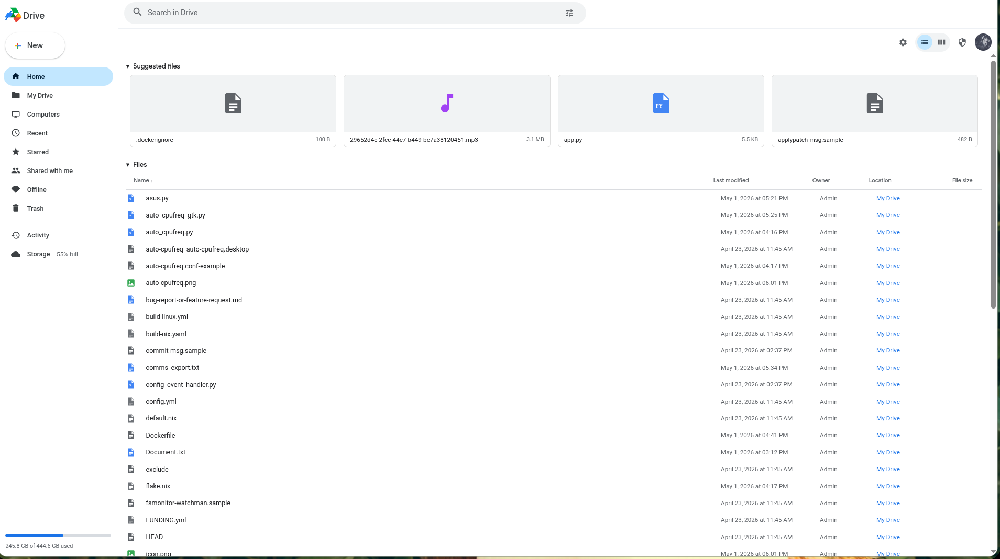
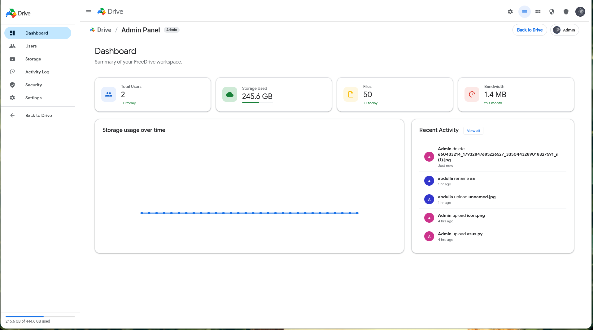

<p align="center">
  
</p>

<h1 align="center">FreeDrive</h1>

<p align="center">
  <strong>Self-hosted cloud storage with a familiar Drive-like UX.</strong><br/>
  Single Go binary, embedded SQLite, disk-backed storage, admin panel, and modern web UI.
</p>
<p align="center"><strong>Licensed under MIT</strong></p>

<p align="center">
  <a href="https://github.com/marcinx98x/freedrive"></a>
  <a href="https://github.com/marcinx98x/freedrive/releases"></a>
  <a href="https://github.com/marcinx98x/freedrive/stargazers"></a>
  <a href="https://github.com/marcinx98x/freedrive/blob/master/LICENSE"></a>
  <a href="https://github.com/marcinx98x/freedrive"></a>
  <a href="https://hub.docker.com/r/marcinx98x/freedrive"></a>
</p>

---

## Table of Contents

- [Overview](#overview)
- [Screenshots](#screenshots)
- [Core Features](#core-features)
- [Admin Capabilities](#admin-capabilities)
- [Architecture](#architecture)
- [Security Model](#security-model)
- [Quick Start](#quick-start)
- [Production Install (systemd)](#production-install-systemd)
- [Configuration](#configuration)
- [API Reference](#api-reference)
- [Project Structure](#project-structure)
- [Deployment Options](#deployment-options)
- [Operations](#operations)
- [Star History](#star-history)
- [Troubleshooting](#troubleshooting)
- [Contributing](#contributing)
- [License](#license)

---

## Overview

FreeDrive is an open-source, self-hosted storage platform designed to feel instantly familiar for users coming from mainstream cloud drives.

What makes it practical:

- Single binary backend (`Go`) with embedded web assets
- Embedded SQLite database (no external DB required)
- Local disk storage backend
- JWT access + refresh-token authentication
- User and admin workspaces in one application
- Simple deployment with direct binary run or `systemd`

FreeDrive is ideal for:

- Developers wanting full ownership of files and auth
- Small teams needing private internal storage
- Self-hosting enthusiasts who want low operational overhead

---

## Screenshots

### User Workspace



### Admin Workspace



---

## Core Features

### 1. Drive-like File Management UX

- Folder-based navigation and root view
- Suggested/recent style listings
- List/grid view switching
- Search and search filters
- Context menus and keyboard shortcuts

### 2. Sidebar: My Drive & Computers

- **My Drive** — primary file space with an expandable sidebar folder tree (lazy-loaded folders, expand/collapse chevrons, path sync on navigation)
- **Computers** — separate sidebar section for desktop backup/sync (isolated from My Drive root folders; API-ready for future desktop clients)
- Drive-style pill highlights on nav rows, with chevrons inside the active/hover area

### 3. File Lifecycle

- Upload files via web UI
- Download encrypted blob payloads with metadata headers
- Rename and move files between folders
- Soft delete to Trash
- Restore from Trash
- Permanent delete

### 4. Versioning Support

- File version records are kept when content is updated
- List versions per file
- Restore an earlier version

### 5. Sharing Model

- User-to-user sharing data model (`user_shares`)
- Share-link data model (`share_links`)
- "Shared with me" and "Shared by me" listing paths

### 6. Storage & Quota Awareness

- Per-user quota enforcement during uploads/content updates
- Used-bytes accounting on delete/restore/permanent-delete paths
- Disk usage endpoint for runtime visibility

### 7. Activity Logging

- File/folder actions are recorded in activity logs
- User and admin activity listing endpoints

### 8. Embedded App Delivery

- Frontend is embedded with `go:embed`
- Single process serves API + SPA + static assets

---

## Admin Capabilities

Admin routes are role-protected and available under `/api/v1/admin/*`.

### User Management

- List users
- Create users
- Update role/quota/username
- Delete users (with self-delete protection)
- Trigger password reset email flow

### Invite System

- Create invite links with:
  - role
  - max uses
  - quota bytes
- List invites
- Invite usage tracking and expiration checks

### Operational Controls

- View aggregate stats (`total_users`, `total_used`, `total_quota`)
- View global activity feed
- Save/retrieve admin settings
- Run backup snapshot for admin settings

### Email / SMTP

- SMTP test endpoint
- Password reset email dispatch
- Configurable sender and TLS behavior

---

## Architecture

FreeDrive follows a clean layered structure:

- `api` layer: HTTP routes, handlers, middleware
- `service` layer: business logic (auth, file, folder)
- `repository` layer: persistence interfaces + SQLite implementations
- `storage` layer: disk blob IO

Runtime flow summary:

1. Request hits `chi` router
2. Global middleware stack executes (CORS, rate-limit, recover, logger)
3. Auth middleware validates JWT when required
4. Handler validates input and calls service/repo
5. Service applies policy (quota/ownership/versioning/activity)
6. Response serialized as JSON

---

## Security Model

### Authentication

- Access token: JWT
- Refresh token: random token, stored hashed in DB
- Token rotation on refresh
- Logout revokes refresh token

### Authorization

- Protected API group requires valid access token
- Admin routes use explicit admin-role middleware
- User-scoped operations enforce ownership checks in services

### Secrets

- `FREEDRIVE_JWT_SECRET` can be provided via env
- If omitted, it is generated and stored in `data/jwt_secret.key`

### Rate Limiting

Global limiter enabled in router:

- `100 req/sec`
- `burst 200`

### Storage Note

Frontend transmits encrypted payload metadata (`iv`, encrypted size), and backend stores encrypted blob data and file metadata. If your threat model requires strict end-to-end guarantees, review the current crypto/key flow before production rollout.

---

## Quick Start

### Prerequisites

- Go (matching `go.mod` requirements)
- Linux/macOS/WSL recommended for local development

### Run Locally

```bash
go mod download
go run ./cmd/freedrive
```

Open:

- `http://localhost:8080`

Default bootstrap admin (if first user is auto-created):

- Email: `admin@freedrive.local`
- Password: `admin123`

Important: change defaults immediately in non-dev environments.

### Run Published Docker Image

Images are built by [GitHub Actions](.github/workflows/docker-publish.yml) on push to `master` and published to:

- **Docker Hub:** [`marcinx98x/freedrive`](https://hub.docker.com/r/marcinx98x/freedrive) — public, no login required
- **GHCR:** `ghcr.io/marcinx98x/freedrive` — may require GitHub login if the package is private

Tags: `latest`, `master`, `sha-<commit>`. Multi-arch: `linux/amd64`, `linux/arm64`.

**Docker Hub (recommended):**

```bash
docker pull marcinx98x/freedrive:latest
docker run -d \
  --name freedrive \
  -p 8080:8080 \
  -e FREEDRIVE_ADMIN_EMAIL=admin@freedrive.local \
  -e FREEDRIVE_ADMIN_PASSWORD=change-me-now \
  -v freedrive-data:/app/data \
  marcinx98x/freedrive:latest
```

**GHCR** (log in first if the package is private; GitHub PAT with `read:packages` scope):

```bash
echo $GITHUB_TOKEN | docker login ghcr.io -u marcinx98x --password-stdin
docker pull ghcr.io/marcinx98x/freedrive:latest
docker run -d \
  --name freedrive \
  -p 8080:8080 \
  -e FREEDRIVE_ADMIN_EMAIL=admin@freedrive.local \
  -e FREEDRIVE_ADMIN_PASSWORD=change-me-now \
  -v freedrive-data:/app/data \
  ghcr.io/marcinx98x/freedrive:latest
```

To make the GHCR package publicly pullable without login: GitHub → **Packages** → **freedrive** → **Package settings** → **Change visibility** → **Public**.

### Run With Docker Compose

Default image in `docker-compose.yml`: `marcinx98x/freedrive:latest` (Docker Hub, public). To use GHCR instead, set `image: ghcr.io/marcinx98x/freedrive:latest` in the compose file or override it when starting. Use `docker compose up --build` only when developing from source.

```bash
cp .env.example .env
docker compose pull
docker compose up -d
```

Open:

- `http://localhost:8080`

Runtime data is stored in the `freedrive-data` Docker volume. Update `.env` before first start to set a strong admin password and optional JWT secret.

### Automatic Updates (Watchtower)

`docker-compose.yml` includes a [Watchtower](https://containrrr.dev/watchtower/) service. It periodically checks Docker Hub for a newer `latest` image and automatically pulls it and recreates the FreeDrive container, so you always run the newest version without a manual re-pull.

- Scope is limited by label (`com.centurylinklabs.watchtower.enable=true` on the `freedrive` service via `--label-enable`), so Watchtower only updates FreeDrive and leaves your other containers untouched.
- `--cleanup` removes the old image after each update.
- Default check interval is `3600` seconds (hourly). Change `--interval` in the `watchtower` service's `command` to adjust it, or remove the whole `watchtower` service to disable auto-updates.

### Synology: Reliable Update

Container Manager's "update" on a `latest`-tagged container is unreliable: it often reports success while still running the old image (it pulls the image but does not recreate the container from the new digest). Use one of the options below.

**Option A (recommended): let Watchtower do it.** Import `docker-compose.yml` as a Project. Watchtower starts alongside FreeDrive, pulls new `latest` images and recreates the container automatically — no manual "download latest" needed. The `freedrive-data` volume is preserved across recreations, so users and files are safe.

**Option B: manual recreate (keep the volume).**

1. Container Manager -> Container -> stop, then delete the `freedrive` container. Do NOT delete the `freedrive-data` volume — that is where the database and files live, and it survives.
2. Container Manager -> Registry (or Image) -> download `marcinx98x/freedrive:latest` again.
3. Recreate the container with the same volume mapping to `/app/data` and the same port.

**Option C: pin an immutable tag.** Instead of `latest`, use an immutable `sha-xxxxxxx` tag (visible on Docker Hub) and bump it deliberately when you want to update. This removes all ambiguity about which build is running.

**Verify the running image over SSH:**

```bash
# digest the container is currently running
docker inspect --format '{{.Image}}' freedrive
# digest of the local latest image
docker inspect --format '{{index .RepoDigests 0}}' marcinx98x/freedrive:latest
```

After the app itself is updated, the browser fetches fresh frontend assets automatically (the server sends `ETag` + `Cache-Control: no-cache`); a hard refresh (Ctrl+F5) is only needed if you loaded a version built before this behavior existed.

---

## Production Install (systemd)

The repository includes `scripts/install.sh` for Linux host installation.

```bash
chmod +x scripts/install.sh
./scripts/install.sh
```

What it does:

- Prompts for admin credentials
- Downloads the latest release binary
- Installs binary to `/opt/freedrive/freedrive`
- Writes env file at `/etc/freedrive/freedrive.env`
- Creates/starts `freedrive.service`

To update an existing systemd installation to the latest release:

```bash
curl -fsSL https://abdullaabdullazade.github.io/freedrive/update.sh -o update.sh
chmod +x update.sh
./update.sh
```

The updater verifies the release checksum, keeps your existing data and `/etc/freedrive/freedrive.env`, backs up the current binary to `/opt/freedrive/freedrive.bak`, installs the new binary, and restarts `freedrive.service`.

Operational commands:

```bash
sudo systemctl status freedrive
sudo systemctl restart freedrive
sudo journalctl -u freedrive -f
```

Browser encryption note: uploads use WebCrypto when the browser allows it. Use `http://localhost:8080` or HTTPS for encrypted uploads; on plain HTTP server addresses, FreeDrive warns first and uploads without browser-side encryption.

Note: current systemd template runs service as `root`. For hardened production setups, consider a dedicated system user and tighter filesystem permissions.

---

## Configuration

Environment variables loaded by `internal/config/config.go`:

| Variable | Description | Default |
|---|---|---|
| `FREEDRIVE_PORT` | HTTP port | `8080` |
| `FREEDRIVE_DATA_DIR` | Data directory (DB, blobs, keys) | `./data` |
| `FREEDRIVE_JWT_SECRET` | JWT signing secret | auto-generated if empty |
| `FREEDRIVE_MAX_UPLOAD_MB` | Max upload size (MB) | `5120` |
| `FREEDRIVE_ADMIN_EMAIL` | Initial admin email | `admin@freedrive.local` |
| `FREEDRIVE_ADMIN_PASSWORD` | Initial admin password | `admin123` |

---

## API Reference

Base path: `/api/v1`

### Public Auth

- `POST /auth/register`
- `POST /auth/login`
- `POST /auth/refresh`
- `POST /auth/logout`
- `POST /auth/reset-password`

### Protected (Authenticated)

- `GET /me/storage`
- `GET /activity`
- `GET /disk-stats`

#### Files

- `POST /files/upload`
- `GET /files`
- `GET /files/trash`
- `GET /files/{id}`
- `GET /files/{id}/download`
- `PATCH /files/{id}`
- `POST /files/{id}/content`
- `DELETE /files/{id}`
- `POST /files/{id}/restore`
- `DELETE /files/{id}/permanent`
- `GET /files/{id}/versions`
- `POST /files/{id}/versions/{version}/restore`

#### Folders

- `POST /folders`
- `GET /folders/root`
- `GET /folders/{id}`
- `PATCH /folders/{id}`
- `DELETE /folders/{id}`
- `GET /folders/{id}/breadcrumb`

#### Computers

- `GET /computers`
- `GET /computers/{id}`
- `POST /computers/register`

### Admin (Requires `admin` role)

- `GET /admin/users`
- `POST /admin/users`
- `PATCH /admin/users/{id}`
- `DELETE /admin/users/{id}`
- `POST /admin/users/{id}/reset-password`
- `GET /admin/stats`
- `POST /admin/invites`
- `GET /admin/invites`
- `GET /admin/activity`
- `GET /admin/settings`
- `POST /admin/settings`
- `POST /admin/test-email`
- `POST /admin/backup/run`

### Health

- `GET /health`

---

## Project Structure

```text
cmd/freedrive/
  main.go                 # app bootstrap
  web/                    # embedded frontend (HTML/CSS/JS)

internal/
  api/
    router.go             # route graph + middleware wiring
    handlers/             # HTTP handlers
    middleware/           # auth, CORS, rate limit
  config/                 # env config + secret generation
  domain/                 # core entities
  repository/             # interfaces
  repository/sqlite/      # sqlite repos + migrations
  service/                # business logic
  storage/                # local disk blob storage

scripts/
  install.sh              # systemd installation helper

docs/
  index.html              # project landing page
  screenshots/            # marketing screenshots
```

---

## Deployment Options

Typical demo/production options:

- VPS (`Hetzner`, `DigitalOcean`, `AWS EC2`) with systemd
- Containerized self-managed deployment (custom Dockerfile)
- PaaS for demo environments (`Railway`, `Render`, `Fly.io`)

Recommended production baseline:

- Reverse proxy (`Caddy` or `Nginx`) with HTTPS
- Periodic backup for `FREEDRIVE_DATA_DIR`
- Strong admin password and rotated JWT secret policy
- Non-root runtime user when possible

---

## Operations

### Data You Should Back Up

At minimum:

- SQLite DB (`$FREEDRIVE_DATA_DIR/*.db`)
- Blob storage (`$FREEDRIVE_DATA_DIR` file hierarchy)
- JWT secret (`$FREEDRIVE_DATA_DIR/jwt_secret.key` if auto-generated)
- Admin settings snapshot (`data/settings.json` and optional backup output)

### Upgrading

1. Stop service
2. Replace binary
3. Start service
4. Check logs and health endpoint

```bash
sudo systemctl stop freedrive
# replace binary
sudo systemctl start freedrive
curl -s http://localhost:8080/api/v1/health
```

---

## Star History

[](https://www.star-history.com/?repos=marcinx98x%2Ffreedrive&type=date&legend=top-left)

---

## Troubleshooting

### Service starts but UI fails

- Confirm process is running: `systemctl status freedrive`
- Check logs: `journalctl -u freedrive -f`
- Validate port mapping / firewall

### Login fails unexpectedly

- Verify JWT secret consistency across restarts
- Ensure system clock is correct
- Confirm refresh token table integrity

### Upload returns size/form errors

- Check `FREEDRIVE_MAX_UPLOAD_MB`
- Ensure reverse proxy request body limits are aligned

### SMTP test/reset mail fails

- Re-check server/port/auth/TLS settings
- Verify sender domain policy (SPF/DKIM/relay restrictions)

---

## Contributing

Contributions are welcome.

Suggested workflow:

1. Fork repository
2. Create feature branch
3. Add/adjust tests where applicable
4. Submit focused PR with clear change summary

If you are proposing architecture-level changes, open an issue first for design alignment.

---

## License

MIT License. See [LICENSE](LICENSE).
